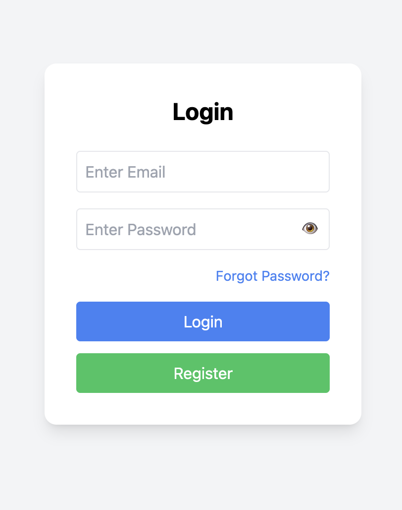
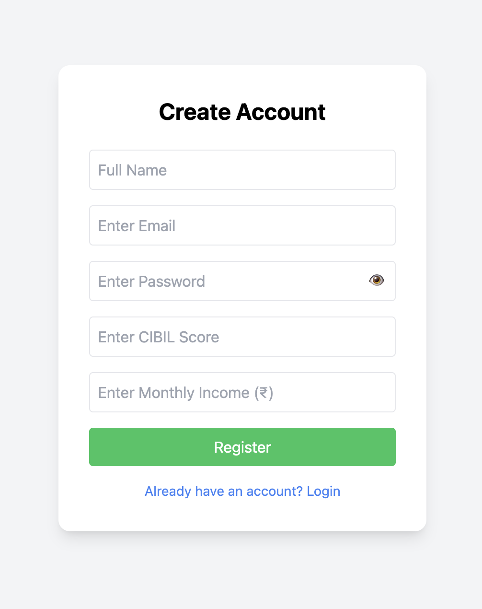
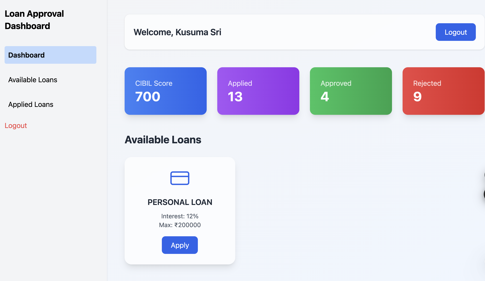
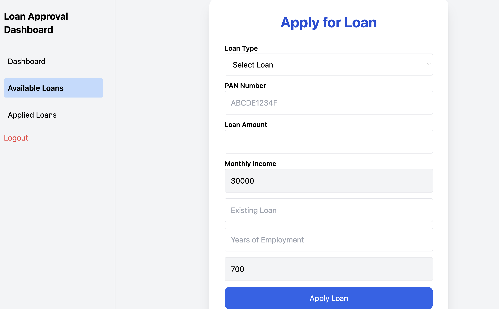
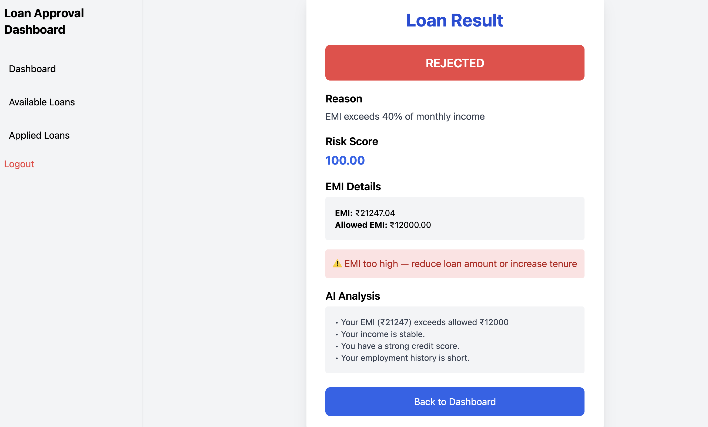
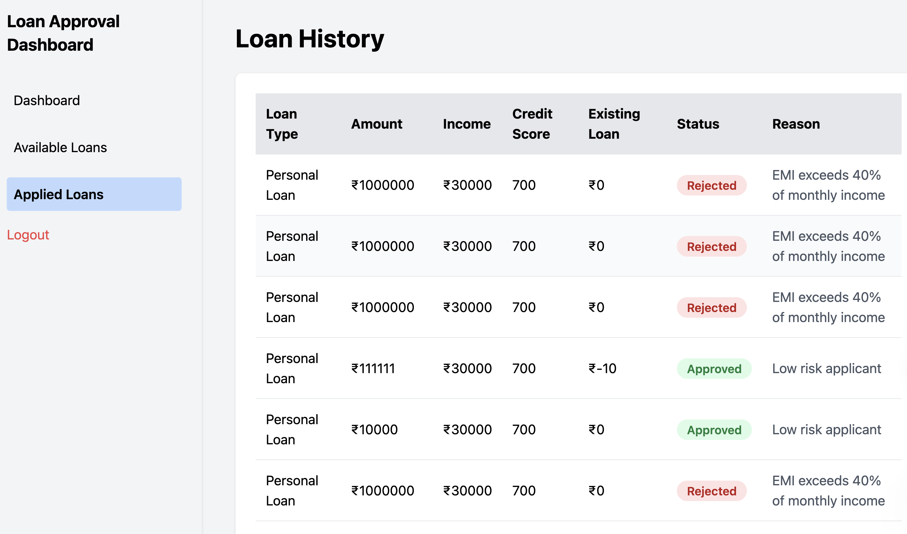

# 🚀 Explainable AI Loan Approval System

## 📌 Overview

The **Explainable AI Loan Approval System** is a full-stack fintech web application that predicts whether a loan will be **Approved ✅ or Rejected ❌** based on user financial data.

Unlike traditional systems, this application focuses on **transparency and trust** by providing **clear, human-readable explanations** for every decision.

---

## 🎯 Features

### 🔐 Authentication

* User Registration & Login
* Secure authentication using JWT
* Session management with local storage

---

### 📊 Dashboard

* View **CIBIL Score**
* Total Applied Loans
* Approved Loans Count
* Rejected Loans Count
* 🎨 Modern fintech UI with icons & premium design

---

### 💰 Loan Application

* Apply for multiple loan types
* Real-time EMI calculation
* Input validation (PAN, income, credit score)
* Smart loan selection interface

---

### 🤖 AI-Based Decision System

Predicts:

* ✅ Loan Approved
* ❌ Loan Rejected

Based on:

* Credit Score
* Income
* Existing Loans
* Employment Years
* EMI-to-Income ratio

---

### 🧠 Explainable AI (XAI)

Provides clear insights such as:

* “Approved due to strong credit score and stable income”
* “Rejected due to high EMI and low income”

✔ Human-readable explanations
✔ Transparency in decision-making

---

### 📜 Loan History

* Track all applied loans
* View status and AI explanations
* Complete user loan records

---

## 🏗️ Tech Stack

### 💻 Frontend

* React.js
* Tailwind CSS
* Axios
* Lucide Icons

### ⚙️ Backend

* Spring Boot
* REST APIs
* JWT Authentication

### 🧠 AI Model

* Python (Flask)
* Scikit-learn
* SHAP (Explainable AI)

### 🗄️ Database

* MySQL

---

## 📂 Project Structure

```
loan-approval-system/
│
├── frontend/        # React Application
├── backend/         # Spring Boot APIs
├── ml-model/        # AI Model (Flask + SHAP)
├── screenshots/     # Project Screenshots
└── README.md
```

---

## 📸 Screenshots

### 🔐 Login Page


### 📝 Register Page


### 🔑 Forgot Password


### 🏠 Dashboard


### 💳 Apply Loan


### 📊 Loan Result


### 📜 Loan History


---

## ⚙️ Installation & Setup

### 🔹 Backend (Spring Boot)

```bash
cd backend
mvn clean install
mvn spring-boot:run
```

### 🔹 Frontend (React)

```bash
cd frontend
npm install
npm run dev
```

### 🔹 AI Model (Flask)

```bash
cd ml-model
python3 app.py
```

---

## 🔗 API Endpoints

| Method | Endpoint                     | Description        |
| ------ | ---------------------------- | ------------------ |
| POST   | `/api/auth/register`         | Register user      |
| POST   | `/api/auth/login`            | User login         |
| POST   | `/api/loan/apply`            | Apply loan         |
| GET    | `/api/loan/history/{userId}` | Loan history       |
| GET    | `/api/loan/eligible`         | Get eligible loans |

---

## 🧠 How It Works

1. User logs in
2. Enters financial details
3. System calculates risk score
4. AI model predicts approval
5. System returns:

   * Loan Status
   * Explanation
6. Data stored in database

---

## 💡 Key Highlights

✔ Full-stack implementation
✔ Real-world fintech use case
✔ Explainable AI integration
✔ EMI-based eligibility logic
✔ Clean & modern UI
✔ Secure authentication (JWT)

---
